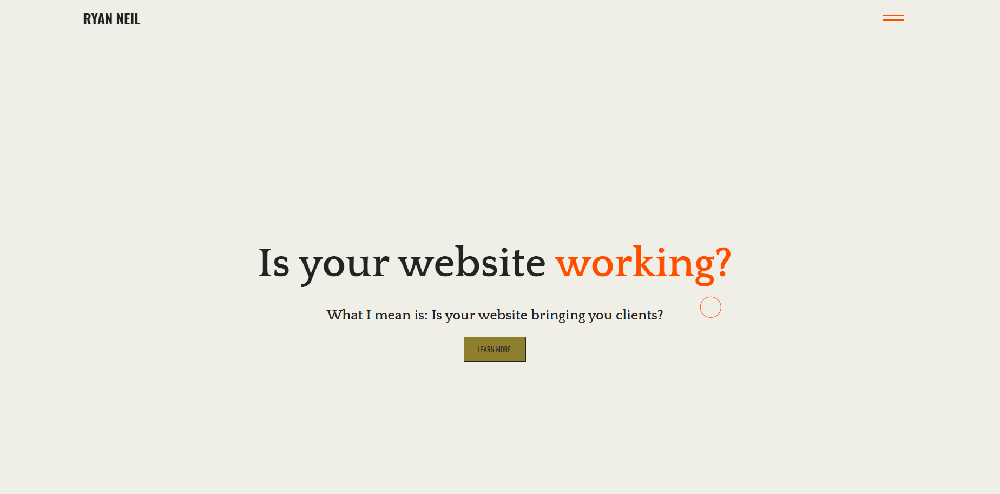
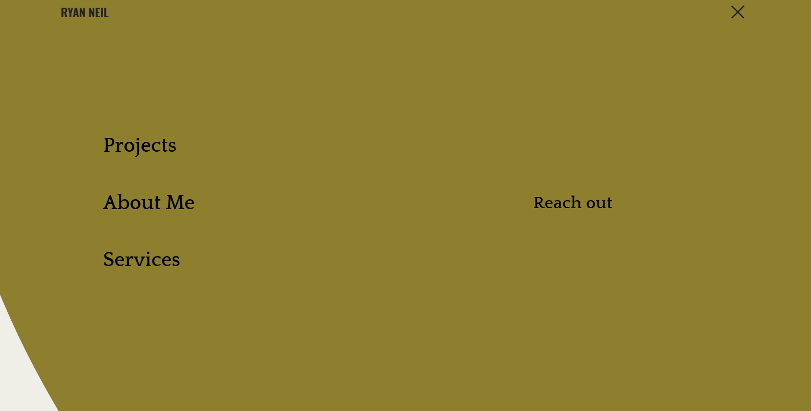

# Updated-Portfolio

## Description

This is an update to my initial portfolio. This is update comes after diving into Javascript. I wanted to incorporate more interactions in my portfolio. I did this by attempting multiple animations, however, I succeeded in two major ones. I added a cursor animation as well as a burger menu animation.

## To Do List
1. Project Page
2. About Page
3. Service Page
4. Clean Up Home Page
5. Responsiveness

## Outside Tools Used
ScrollMagic - Failed

GSAP - Mostly Successful
## Access

https://github.com/vegaryanneil/Updated-Portfolio

https://vegaryanneil.github.io/Updated-Portfolio/

## Resources

Dev Ed

https://www.youtube.com/watch?v=H4MkGzoACpQ

https://www.youtube.com/watch?v=TpwpAYi-p2w